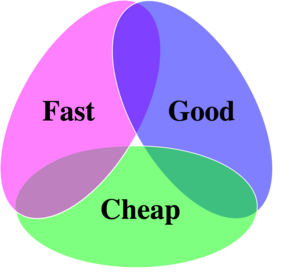
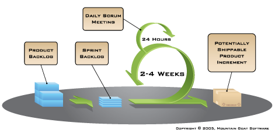

# SDLC

## What is Software Development Life Cycle?

* Also called "System Development Life Cycle"

> SDLC is term referring to a process or set of processes for planning, creating, testing, and deploying an software product (i.e. a library, framework, application, website, etc.)

## What is the goal of SDLC?

* **Quality**: Ensuring that a high-quality product is built and delivered
* **Scope**: Delivering the _correct_ product
* **Cost**: Estimating and controlling cost

### The Software Triangle

### The Iron Pyramid?

Or simply:

BOTTOM LINE: You get to pick 2 out of 3

### Managing Risk

Risk is anything that can threaten the *success* of a software project.

> How do we measure and track risk?

### Traditional Approach - Waterfall

Waterfall follows a very *familiar* approach to designing and building a system:

* Figure out what you want
* Design it
* Build it
* Test it
* Ship it
* Enjoy

But *waterfall* is not usually a good fit for large *Software* projects, because certain *assumptions* do not hold.

Waterfall _assumes_ that we know everything we need to know at the beginning of the project:

* What features are needed
* What technologies are a good fit
* How long it will take
* How many developers we need

Waterfall attempts to answer these questions and _lock them down_ near the beginning of the project. Then it takes a _work of congress_ to change courses midstream.

The reason that these assumptions don't hold for most Software Development projects is because the software industry is *highly volatile*.

* Markets change
* Technologies change
* What seemed like a good idea 3 months ago seems silly or irrelevant now.

We need a process for building software that can *ADAPT* quickly to change!

### Why is Waterfall so Attractive?

Waterfall is attractive because:

* It is familiar - it is how we generally approach big projects
* It is logical, intuitive, and sequential
* It is easy to work when budgeting a project and dealing with legal / contract matters
* It gives the _illusion_ of managing and minimizing risk

For another perspective see: [Thoughtbot Playbook - No Fixed Bids](https://thoughtbot.com/playbook/our-company/sales#no-fixed-bids).

### Enter Agile

Agile asks "When do we know the most about a project (at the beginning or at the end)?"

Agile accepts the fact that everything continues to change at a rapid rate:

* Markets change
* Technology changes
* Culture changes
* Business dynamics change
* Our understanding continues to evolve

So we must be *agile* in our approach to developing a software solution to a problem.

### For Further Reading

* [Agile Lesson](https://github.com/ga-wdi-lessons/agile)
* [Overview of Agile Methodology](http://www.slideshare.net/hareshkarkar/overview-of-agile-methodology)
* [Thoughtbot Playbook - No Fixed Bids](https://thoughtbot.com/playbook/our-company/sales#no-fixed-bids)
* [Thoughtbot - Why Fixed Bids Are Bad For Clients, Too](https://robots.thoughtbot.com/why-fixed-bids-are-bad-for-clients-too)
