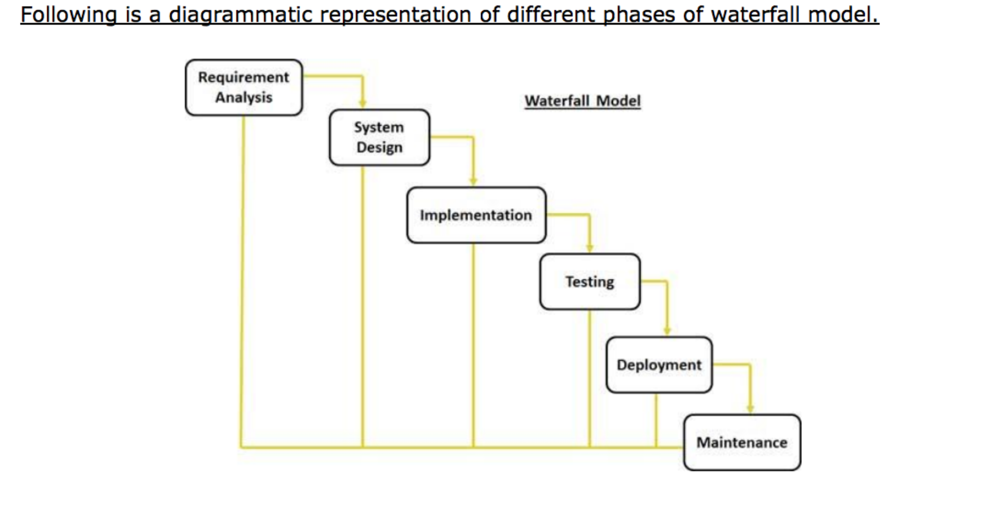
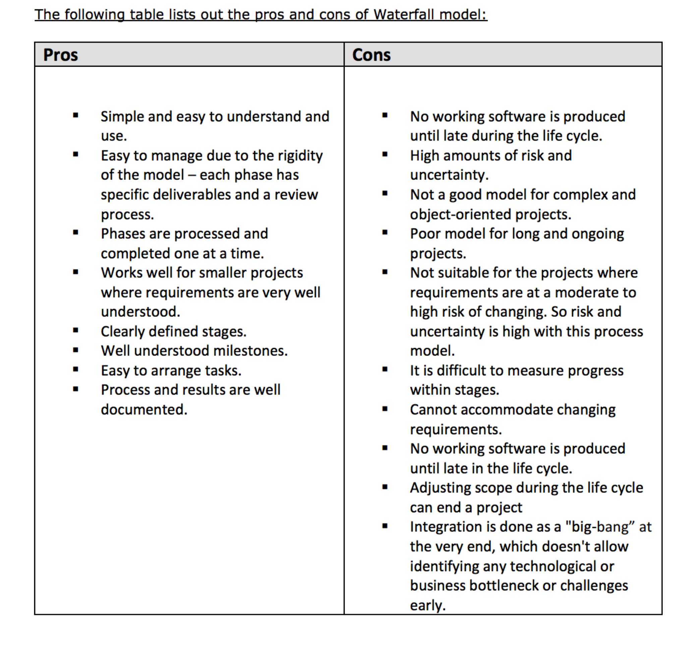
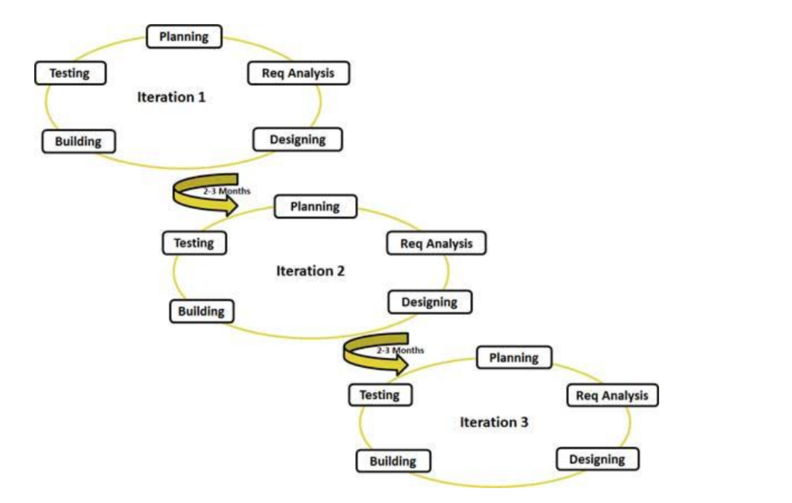
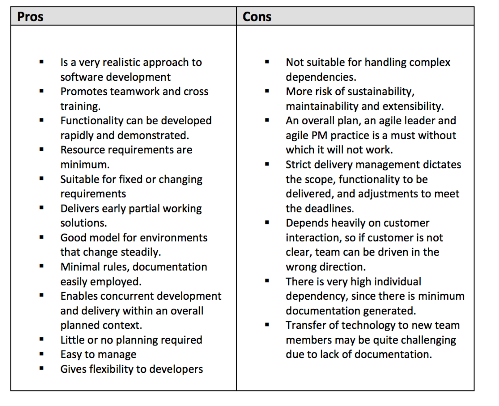
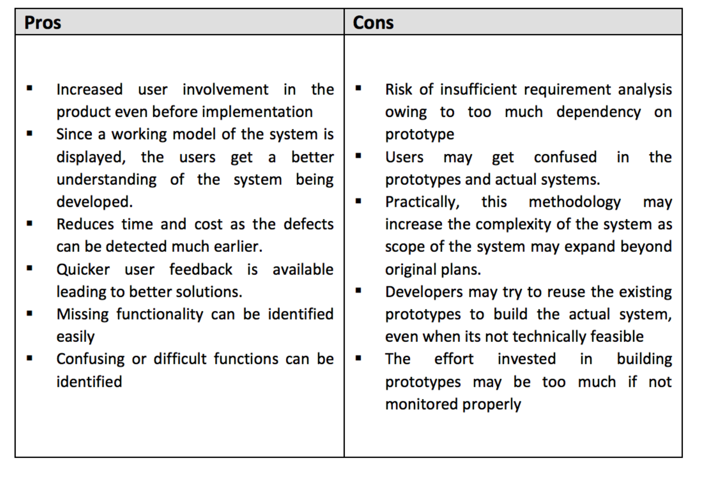

# Software Development life Cycle (SDLC)

## Objectives

By the end of this, students should be able to:

- Understand the software development life cycle
- Understand the importance of SDLC.
- Understand the SDLS componets

## Compilation

SDLC, Software Development Life Cycle is a process used by software industry to
design, develop and test high quality softwares. The SDLC aims to produce a high
quality software that meets or exceeds customer expectations, reaches completion within
times and cost estimates

SDLC is the acronym of Software Development Life Cycle. It is also called as
Software development process. The software development life cycle (SDLC) is a
framework defining tasks performed at each step in the software development process.
ISO/IEC 12207 is an international standard for software life-cycle processes. It aims to
be the standard that defines all the tasks required for developing and maintaining
software.

### What is SDLC

What is SDLC?
SDLC is a process followed for a software project, within a software organization. It
consists of a detailed plan describing how to develop, maintain, replace and alter or
enhance specific software. The life cycle defines a methodology for improving the quality
of software and the overall development process.

### Fig1

## The Stages of SDLC.

### Stage 1:Planning and Requirement Analysis :
Requirement analysis is the most important
and fundamental stage in SDLC. It is performed by the senior members of the team with inputs
from the customer, the sales department, market surveys and domain experts in the industry.
This information is then used to plan the basic project approach and to conduct product
feasibility study in the economical, operational, and technical areas.
Planning for the quality assurance requirements and identification of the risks associated with
the project is also done in the planning stage. The outcome of the technical feasibility study is
to define the various technical approaches that can be followed to implement the project
successfully with minimum risks.
### Stage 2: Defining Requirements :
Once the requirement analysis is done the next step is to
clearly define and document the product requirements and get them approved from the
customer or the market analysts. This is done through ‘SRS’ – Software Requirement
Specification document which consists of all the product requirements to be designed and
developed during the project life cycle.
### Stage 3: Designing the product architecture :
SRS is the reference for product architects to
come out with the best architecture for the product to be developed. Based on the
requirements specified in SRS, usually more than one design approach for the product
architecture is proposed and documented in a DDS - Design Document Specification. This DDS
is reviewed by all the important stakeholders and based on various parameters as risk
assessment, product robustness, design modularity , budget and time constraints , the best
design approach is selected for the product.
A design approach clearly defines all the architectural modules of the product along with its
communication and data flow representation with the external and third party modules (if
any). The internal design of all the modules of the proposed architecture should be clearly
defined with the minutest of the details in DDS.
###Stage 4: Building or Developing the Product :
In this stage of SDLC the actual development
starts and the product is built. The programming code is generated as per DDS during this
stage. If the design is performed in a detailed and organized manner, code generation can be
accomplished without much hassle.
Developers have to follow the coding guidelines defined by their organization and
programming tools like compilers, interpreters, debuggers etc are used to generate the code.
Different high level programming languages such as C, C++, Pascal, Java, and PHP are used for
coding. The programming language is chosen with respect to the type of software being
developed.

###Stage 5: Testing the Product :
This stage is usually a subset of all the stages as in the modern
SDLC models, the testing activities are mostly involved in all the stages of SDLC. However this
stage refers to the testing only stage of the product where products defects are reported,
tracked, fixed and retested, until the product reaches the quality standards defined in the SRS.

###Stage 6: Deployment in the Market and Maintenance :
Once the product is tested and ready
to be deployed it is released formally in the appropriate market. Sometime product
deployment happens in stages as per the organizations’ business strategy. The product may
first be released in a limited segment and tested in the real business environment (UAT- User
acceptance testing).
Then based on the feedback, the product may be released as it is or with suggested
enhancements in the targeting market segment. After the product is released in the market,
its maintenance is done for the existing customer base.

###SDLC Models
There are various software development life cycle models defined and designed which are
followed during software development process. These models are also referred as "Software
Development Process Models". Each process model follows a Series of steps unique to its type,
in order to ensure success in process of software development. Following are the most
important and popular SDLC models followed in the industry:
 Waterfall Model
 Iterative Model
 Spiral Model
 V-Model
 Big Bang Model

The other related methodologies are Agile Model, RAD Model – Rapid Application
Development and Prototyping Models.

###Waterfall Model
The Waterfall Model was first Process Model to be introduced. It is also referred to as
a linear-sequential life cycle model. It is very simple to understand and use. In a
waterfall model, each phase must be completed before the next phase can begin and there
is no overlapping in the phases.

Waterfall model is the earliest SDLC approach that was used for software
development .The waterfall Model illustrates the software development process in a linear
sequential flow; hence it is also referred to as a linear-sequential life cycle model. This
means that any phase in the development process begins only if the previous phase is
complete. In waterfall model phases do not overlap..

Waterfall Model design
Waterfall approach was first SDLC Model to be used widely in Software Engineering to
ensure success of the project. In "The Waterfall" approach, the whole process of software
development is divided into separate phases. In Waterfall model, typically, the outcome
of one phase acts as the input for the next phase sequentially.

###fig2

###The sequential phases in Waterfall model are:

### Requirement Gathering and analysis All possible requirements of the system to be
developed are captured in this phase and documented in a requirement specification
doc.

### System Design: The requirement specifications from first phase are studied in this
phase and system design is prepared. System Design helps in specifying hardware and
system requirements and also helps in defining overall system architecture.

### Implementation: With inputs from system design, the system is first developed in
small programs called units, which are integrated in the next phase. Each unit is
developed and tested for its functionality which is referred to as Unit Testing.

### Integration and Testing: All the units developed in the implementation phase are
integrated into a system after testing of each unit. Post integration the entire system
is tested for any faults and failures.

### Deployment of system: Once the functional and non functional testing is done, the
product is deployed in the customer environment or released into the market.

### Maintenance: There are some issues which come up in the client environment. To fix
those issues patches are released. Also to enhance the product some better versions
are released. Maintenance is done to deliver these changes in the customer
environment.

All these phases are cascaded to each other in which progress is seen as flowing steadily
downwards (like a waterfall) through the phases. The next phase is started only after the
defined set of goals are achieved for previous phase and it is signed off, so the name
"Waterfall Model". In this model phases do not overlap.
Waterfall Model Application
Every software developed is different and requires a suitable SDLC approach to be
followed based on the internal and external factors. Some situations where the use of
Waterfall model is most appropriate are:

*Requirements are very well documented, clear and fixed
*Product definition is stable
*Technology is understood and is not dynamic
*There are no ambiguous requirements
*Ample resources with required expertise are available to support the product
*The project is short

###Waterfall Model Pros & Cons
The advantage of waterfall development is that it allows for departmentalization and
control. A schedule can be set with deadlines for each stage of development and a
product can proceed through the development process model phases one by one.
Development moves from concept, through design, implementation, testing, installation,
troubleshooting, and ends up at operation and maintenance. Each phase of development
proceeds in strict order.
The disadvantage of waterfall development is that it does not allow for much reflection or
revision. Once an application is in the testing stage, it is very difficult to go back and
change something that was not well-documented or thought upon in the concept stage.

###Agile Model
Agile SDLC model is a combination of iterative and incremental
process models with focus on process adaptability and customer
satisfaction by rapid delivery of working software product.
Agile Methods break the product into small incremental builds. These builds are
provided in iterations. Each iteration typically lasts from about one to three weeks. Every
iteration involves cross functional teams working simultaneously on various areas like
planning, requirements analysis, design, coding, unit testing, and acceptance testing. At
the end of the iteration a working product is displayed to the customer and important
stakeholders.

###What is Agile?
Agile model believes that every project needs to be handled differently and the existing
methods need to be tailored to best suit the project requirements. In agile the tasks are
divided to time boxes (small time frames) to deliver specific features for a release.
Iterative approach is taken and working software build is delivered after each iteration.
Each build is incremental in terms of features; the final build holds all the features
required by the customer.

Agile thought process had started early in the software development and started
becoming popular with time due to its flexibility and adaptability. The most popular agile
methods include Rational Unified Process (1994), Scrum (1995), Crystal Clear, Extreme
Programming (1996), Adaptive Software Development, Feature Driven Development,
and Dynamic Systems Development Method (DSDM) (1995). These are now collectively
referred to as agile methodologies, after the Agile Manifesto was published in 2001.

###Following are the Agile Manifesto principles:
*Individuals and interactions – in agile development, self-organization and
motivation are important, as are interactions like co-location and pair
programming.

*Working software – Demo working software is considered the best means of
communication with the customer to understand their requirement, instead of
just depending on documentation.

*Customer collaboration – As the requirements cannot be gathered completely
in the beginning of the project due to various factors, continuous customer
interaction is very important to get proper product requirements.
*Responding to change – agile development is focused on quick responses to
change and continuous development.

###Agile Vs Traditional SDLC Models

Agile is based on the adaptive software development methods where as the traditional
SDLC models like waterfall model is based on predictive approach.
Predictive teams in the traditional SDLC models usually work with detailed planning and
have a complete forecast of the exact tasks and features to be delivered in the next few
months or during the product life cycle. Predictive methods entirely depend on the
requirement analysis and planning done in the beginning of cycle. Any changes to be
incorporated go through a strict change control management and prioritization.
Agile uses adaptive approach where there is no detailed planning and there is clarity on
future tasks only in respect of what features need to be developed. There is feature
driven development and the team adapts to the changing product requirements
dynamically. The product is tested very frequently, through the release iterations,
minimizing the risk of any major failures in future.
Customer interaction is the backbone of Agile methodology, and open communication
with minimum documentation are the typical features of Agile development environment.
The agile teams work in close collaboration with each other and are most often located in
the same geographical location.

###Agile Model Pros and Cons
Agile methods are being widely accepted in the software world recently, however, this
method may not always be suitable for all products. Here are some pros and cons of the
agile model.

###Software Prototyping Overview

The Software Prototyping refers to building software application
prototypes which display the functionality of the product under
development but may not actually hold the exact logic of the
original software.

Software prototyping is becoming very popular as a software development model,
as it enables to understand customer requirements at an early stage of development. It
helps get valuable feedback from the customer and helps software designers and
developers understand about what exactly is expected from the product under
development.

###What is Software Prototyping?
Prototype is a working model of software with some limited functionality. The prototype
does not always hold the exact logic used in the actual software application and is an
extra effort to be considered under effort estimation. Prototyping is used to allow the
users evaluate developer proposals and try them out before implementation. It also helps
understand the requirements which are user specific and may not have been considered
by the developer during product design.

Following is the stepwise approach to design a software prototype:
*Basic Requirement Identification
This step involves understanding the very basics product requirements especially
in terms of user interface. The more intricate details of the internal design and
external aspects like performance and security can be ignored at this stage.
*Developing the initial Prototype
The initial Prototype is developed in this stage, where the very basic
requirements are showcased and user interfaces are provided. These features
may not exactly work in the same manner internally in the actual software
developed and the workarounds are used to give the same look and feel to the
customer in the prototype developed.
*Review of the Prototype
The prototype developed is then presented to the customer and the other
important stakeholders in the project. The feedback is collected in an organized
manner and used for further enhancements in the product under development.
*Revise and enhance the Prototype

The feedback and the review comments are discussed during this stage and
some negotiations happen with the customer based on factors like , time and
budget constraints and technical feasibility of actual implementation. The
changes accepted are again incorporated in the new Prototype developed and
the cycle repeats until customer expectations are met.

Prototypes can have horizontal or vertical dimensions. Horizontal prototype displays the
user interface for the product and gives a broader view of the entire system, without
concentrating on internal functions. A vertical prototype on the other side is a detailed
elaboration of a specific function or a sub system in the product.

The purpose of both horizontal and vertical prototype is different. Horizontal prototypes
are used to get more information on the user interface level and the business
requirements. It can even be presented in the sales demos to get business in the market.
Vertical prototypes are technical in nature and are used to get details of the exact
functioning of the sub systems. For example, database requirements, interaction and
data processing loads in a given sub system.

Software Prototyping Types
There are different types of software prototypes used in the industry. Following are the
major software prototyping types used widely:
* Throwaway/Rapid Prototyping

Throwaway prototyping is also called as rapid or close ended prototyping. This
type of prototyping uses very little efforts with minimum requirement analysis to
build a prototype. Once the actual requirements are understood, the prototype is
discarded and the actual system is developed with a much clear understanding of
user requirements.

* Evolutionary Prototyping
Evolutionary prototyping also called as breadboard prototyping is based on
building actual functional prototypes with minimal functionality in the beginning.
The prototype developed forms the heart of the future prototypes on top of
which the entire system is built. Using evolutionary prototyping only well
understood requirements are included in the prototype and the requirements are
added as and when they are understood.

* Incremental Prototyping
Incremental prototyping refers to building multiple functional prototypes of the
various sub systems and then integrating all the available prototypes to form a
complete system.

* Extreme Prototyping
Extreme prototyping is used in the web development domain. It consists of three
sequential phases. First, a basic prototype with all the existing pages is
presented in the html format. Then the data processing is simulated using a
prototype services layer. Finally the services are implemented and integrated to
the final prototype. This process is called Extreme Prototyping used to draw
attention to the second phase of the process, where a fully functional UI is
developed with very little regard to the actual services.

###Software Prototyping Application
Software Prototyping is most useful in development of systems having high level of user
interactions such as online systems. Systems which need users to fill out forms or go
through various screens before data is processed can use prototyping very effectively to
give the exact look and feel even before the actual software is developed.
Software that involves too much of data processing and most of the functionality is
internal with very little user interface does not usually benefit from prototyping.
Prototype development could be an extra overhead in such projects and may need lot of
extra efforts.

###Software Prototyping Pros and Cons
Software prototyping is used in typical cases and the decision should be taken very
carefully so that the efforts spent in building the prototype add considerable value to the
final software developed. The model has its own pros and cons discussed as below.

###SDLC Summary
This was about the various SDLC models available and the scenarios in which
these SDLC models are used. The information in this tutorial will help the project
managers decide what SDLC model would be suitable for their project and it would also
help the developers and testers understand basics of the development model being used
for their project.

We have discussed all the popular SDLC models in the industry, both traditional and
Modern. This tutorial also gives you an insight into the pros and cons and the practical
applications of the SDLC models discussed.

*Waterfall and V model are traditional SDLC models and are of sequential type. Sequential
means that the next phase can start only after the completion of first phase. Such
models are suitable for projects with very clear product requirements and where the
requirements will not change dynamically during the course of project completion.

*Iterative and Spiral models are more accommodative in terms of change and are suitable
for projects where the requirements are not so well defined, or the market requirements
change quite frequently. Big Bang model is a random approach to Software development
and is suitable for small or academic projects.

*Agile is the most popular model used in the industry. Agile introduces the concept of fast
delivery to customers using prototype approach. Agile divides the project into small
iterations with specific deliverable features. Customer interaction is the backbone of Agile
methodology, and open communication with minimum documentation are the typical
features of Agile development environment.

*RAD (Rapid Application Development) and Software Prototype are modern techniques to
understand the requirements in a better way early in the project cycle. These techniques
work on the concept of providing a working model to the customer and stockholders to
give the look and feel and collect the feedback. This feedback is used in an organized
manner to improve the product.

